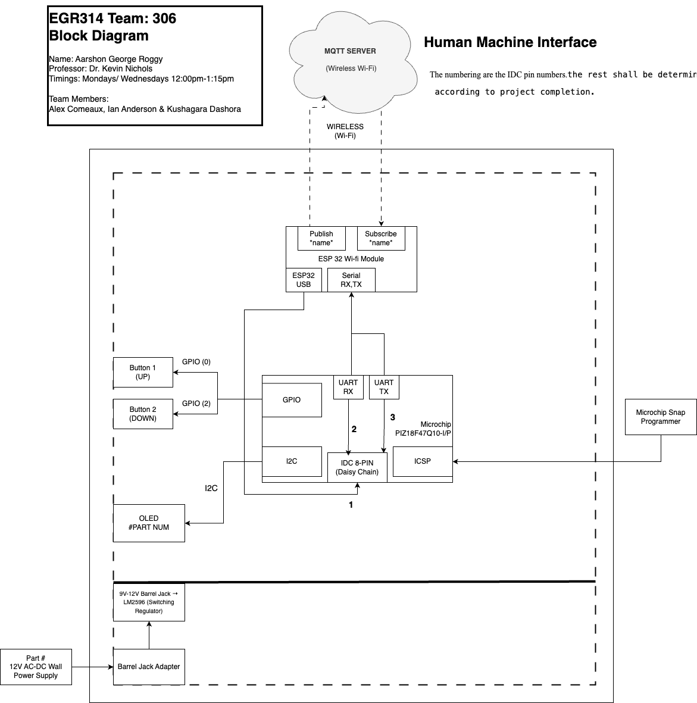

# Embedded Systems Block Diagram
**Author:** Aarshon George Roggy  
**Course:** EGR 314  
**Professor:** Dr. Kevin Nichols  
**Team Members:** Alex Comeaux, Ian Anderson & Kushagara Dashora  

## 📌 Overview  
This page presents the block diagram for the HMI subsystem in our embedded system project.

## 📷 Block Diagram Preview  

## 📁 Download the Block Diagram  
[Download Block Diagram PDF](./assets/documents/314finalblockdiagram.drawio.pdf)
