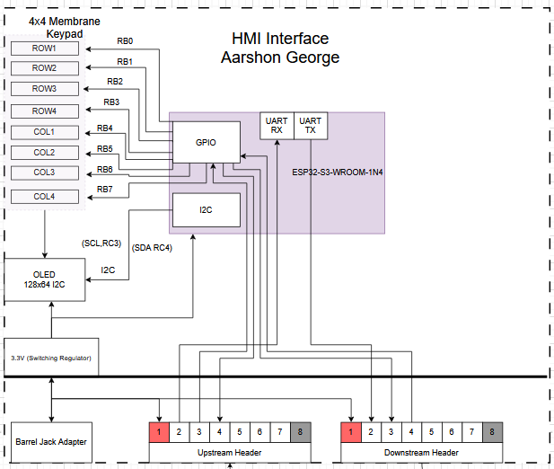

# Embedded Systems Block Diagram

**Author:** Aarshon George Roggy  
**Course:** EGR 314  
**Professor:** Dr. Kevin Nichols  
**Team Members:** Alex Comeaux, Ian Anderson & Kushagara Dashora  

## 📌 Overview  

This page presents the block diagram for the HMI subsystem in our embedded system project.

## Decision Making Process:

**Single‑board “Human‑Machine‑Interface” node:** It must supply all local user I/O for the larger daisy‑chain system.  

**Hot‑plug ribbon‑cable bus:** Each team board has to pass power plus a 9600‑baud UART down the chain and leave four spare lines for team‑specific use (Project Protocol spec).  

**Human‑scale UI:** Rapid tactile entry and glanceable feedback, powered from the same 3.3V rail.
• 4 × 4 membrane keypad: inexpensive, sealed, plug‑in.
• 128 × 64 monochrome OLED: 40 mA max, I²C already in ESP32 ROM drivers.

## 📷 Block Diagram Preview  

## 📁 Download the Block Diagram  

[Download Block Diagram](./assets/documents/314-aarshon-block.drawio1.png)

## Conclusion  

The block diagram is component‑centric so reviewers can trace every electrical relationship, yet bus‑minimal so the firmware stays simple.
By rooting the keypad matrix and OLED locally, exposing a single I²C branch, and treating the daisy‑chain purely as a UART repeater plus power feed, the board meets every functional, electrical and integration requirement of the team specification
