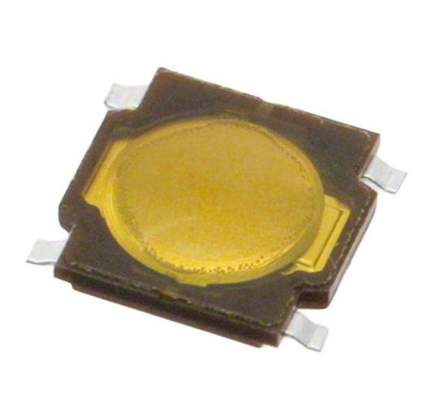
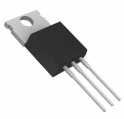

# Component Selection

# Home

## Introduction

For our embedded systems design project, we're developing an interactive weather station designed to engage K-12 students with real-time environmental data. Our goal is to create a learning experience where students can easily navigate through different weather modules- like temperature, humidity, solar power and battery status- using a simple keypad driven interface.

## Criteria

To ensure reliable operation, the HMI system requires a stable power supply, necessitating the integration of a voltage regulator. The PIC18F47Q10 microcontroller, selected for its low power consumption and direct compatibility with 5V peripherals, manages the user inputs and LCD output. The 16x2 I2C LCD is chosen for its low power usage and simple text display, while the 4x4 membrane keypad provides an efficient user interface for navigating through different data modules.  

The power system is a critical aspect of this design, as the microcontroller and peripherals require a stable 5V power supply. A linear voltage regulator (AMS1117-5.0) is selected for its low noise and ease of integration, ensuring consistent voltage to the LCD and keypad without fluctuations. The power budget analysis confirms that the selected regulator meets the current demands of the system while maintaining efficiency​.  

Additionally, the project incorporates a switching voltage regulator as part of a dedicated power supply lab requirement. This LM2575T-3.3G switching regulator is being developed to improve power efficiency, particularly for potential expansion into low-power wireless communication modules. The voltage regulator design process includes selecting appropriate inductors, capacitors, and diodes to ensure stable operation under varying load conditions​.

This systematic component selection ensures the HMI module is power-efficient, durable, and user-friendly, meeting both educational and engineering design constraints.

------------------------------------------------

## Responsibilities:

- Sensing: Although my subsystem does not include direct environmental sensing, it will receive sensor data from the sensing module via UART communication and display relevant readings (e.g., temperature, humidity, solar power levels).
- Actuation: The HMI itself does not control actuators, but it provides a user-friendly way to navigate sensor data, making it a crucial part of the interaction loop.
- Display: I am implementing a 16x2 I2C LCD, which will show current sensor data and allow users to switch between different weather parameters.
- Power: The HMI module operates at 5V, requiring a stable AMS1117-5.0 linear voltage regulator to ensure consistent power delivery.  
  
- Communication: The PIC18F47Q10 microcontroller in my HMI module communicates with other subsystems via I2C (for the LCD) and UART (for receiving sensor data).
  
---------------------------
## Components

## Microcontroller Selection

### Option 1

| **Option** | **Pros** | **Cons** | **Unit Cost & Link** |
| --- | --- | --- | --- |
| **PIC18F47Q10** (Final Choice)  | Low power, optimized for standalone HMI  |No WiFi/Bluetooth | $5.40 [DigiKey](https://www.digikey.com/en/products/detail/microchip-technology/PIC18F47Q10-I-P/10187785)
| |  Supports I2C for LCD and GPIO for Keypad |Limited RAM compared to ESP32 | 
|| Reliable MPLAB XC8 & MCC support  |
| | 5V operation (compatible with LCD & keypad)|


### Option 2
| **Option** | **Pros** | **Cons** | **Unit Cost & Link** |
| --- | --- | --- | --- |
| **PIC18F45K50**   | USB support  |Lacks built-in MCC Harmony compatibility | $6.40 [DigiKey](https://www.digikey.com/en/products/detail/microchip-technology/PIC18F45K50-I-PT/3671506)
| |   More ADC channels   |May require more external circuitry| 
| | Slightly cheaper than PIC18F47Q10  |

### Option 3
| **Option** | **Pros** | **Cons** | **Unit Cost & Link** |
| --- | --- | --- | --- |
|    **ESP32-S3-WROOM-1**   | Built-in WiFi/Bluetooth  |3.3V logic (incompatible with some peripherals) | $3.40 [DigiKey](https://www.digikey.com/en/products/detail/espressif-systems/ESP32-S3-WROOM-1-N8/15200089)
| |   Faster CPU & more RAM   |Higher power consumption| 
| | Integrated hardware acceleration  | More complex firmware development

## Final Selection: PIC18F47Q10 (Option 1)
#### Rationale:

- Low power operation suitable for an HMI system.
- 5V compatibility ensures direct connection with LCD and keypad.
- Sufficient GPIO and I2C support for efficient module control.
- Microchip MCC integration simplifies firmware development.
---------------------------
## Keypad Selection:
The keypad serves as the primary navigation and input interface for the HMI.
### Option 1
| **Option** | **Pros** | **Cons** | **Unit Cost & Link** |
| --- | --- | --- | --- |
| **Membrane 4x4 Keypad** (Final Choice)  | Thin, lightweight, flexible  |Less tactile feedback | $5.95 [DigiKey](https://www.digikey.com/en/products/detail/adafruit-industries-llc/3844/9561536)
|**Part Number:** 1528-2672-ND |  Easy to mount on an enclosure |Can wear out over time | 
| | Low power consumption  |

### Option 2
| **Option** | **Pros** | **Cons** | **Unit Cost & Link** |
| --- | --- | --- | --- |
| **SWITCH JOYSTICK ANALOG 50V**   | Switch is small, making it ideal for compact PCB layouts and space-constrained applications.  |Typically rated for low current (e.g., 50mA–500mA), which may not be suitable for switching higher-power loads directly.  | $2.96 [DigiKey](https://www.digikey.com/en/products/detail/c-k/THB001P/11687191)
|**Part Number:** 108-THB001P-ND |  Provides a clear, tactile response for button presses. |It will eventually degrade over time with heavy usage.| 
| | Suitable for frequent use in embedded systems.  | Requires external components (e.g., pull-down resistors or debouncing circuits) 

### Option 3
| **Option** | **Pros** | **Cons** | **Unit Cost & Link** |
| --- | --- | --- | --- |
| **Tactile Pushbutton Array (Custom)**   | Fully customizable button layout  |Requires additional wiring and PCB routing | $5.95 [DigiKey](https://www.digikey.com/en/products/detail/e-switch/TL3315NF160Q/1870395)
|**Part Number:** TL3315NF160Q |  Strong feedback |Can increase PCB complexity | 

## Final Selection: Membrane 4x4 Keypad (Option 1)
### Rationale:

- Low power consumption is ideal for embedded applications.
- Compact & lightweight for HMI panel mounting.
- Easier integration using GPIO-based matrix scanning.

-------------------------

## LCD Display Selection
The LCD display provides real-time feedback to the user, showing the selected module.

### Option 1
| **Option** | **Pros** | **Cons** | **Unit Cost & Link** |
| --- | --- | --- | --- |
| **16x2 I2C LCD** (Final Choice)  | Easy I2C communication  |No graphical output | $13.95 [DigiKey](https://www.digikey.com/en/products/detail/newhaven-display-intl/NHD-C0216CIZ-FSW-FBW-3V3/2165872)
|**Part Number:** NHD-C0216CIZ-FSW-FBW-3V3 |   Low power, simple to use |Limited characters | 
| | Readable in sunlight  |

### Option 2
| **Option** | **Pros** | **Cons** | **Unit Cost & Link** |
| --- | --- | --- | --- |
| **20x4 I2C LCD**   | Larger display area  |Larger size may not fit in HMI panel | $14.00 [DigiKey](https://www.digikey.com/en/products/detail/orient-display/AMC2004AR-B-Y6WFDY-I2C/22531846?gQT=2)
|  | Same I2C interface as 16x2 | Slightly higher power consumption | 
| | More readable text|

### Option 3
| **Option** | **Pros** | **Cons** | **Unit Cost & Link** |
| --- | --- | --- | --- |
| **128x64 Graphical LCD**  |  Can display graphs/icons  |More complex software control | $17.45 [DigiKey](https://www.digikey.com/en/products/detail/newhaven-display-intl/NHD-C12864B2Z-RN-FBW/1885690?gQT=1)
|  | High contrast output |Requires SPI instead of I2C| 

## Final Selection: 16x2 I2C LCD (Option 1)
### Rationale:

- Supports text-based menu navigation.
- I2C interface reduces GPIO usage.
- Low power consumption suits embedded applications.

---------------------------------
## Voltage Regulator Selection:

### Option 1
| **Option** | **Pros** | **Cons** | **Unit Cost & Link** |
| --- | --- | --- | --- |
| **AMS1117-5V** (Final Choice)  | Low-cost, widely used |Low efficiency (linear regulator) | $0.35 [DigiKey](https://www.digikey.com/en/products/detail/evvo/AMS1117-5-0/24370130)
|**Part Number:** AMS1117-5.0 |  Simple circuit design |Produces heat at high loads | 


### Option 2
| **Option** | **Pros** | **Cons** | **Unit Cost & Link** |
| --- | --- | --- | --- |
| **LM7805 Linear Regulator**   | Simple drop-in solution |Higher power loss than AMS1117 | $1.07 [DigiKey](https://www.digikey.com/en/products/detail/onsemi/MC7805CTG/919333)
|**Part Number:** MC7805CTG |  Stable 5V output | Requires heatsink at higher currents| 


### Option 3
| **Option** | **Pros** | **Cons** | **Unit Cost & Link** |
| --- | --- | --- | --- |
| **LM2575 Switching Regulator**  |  Higher efficiency  |More complex circuit (requires inductor) | $2.84 [DigiKey](https://www.digikey.com/en/products/detail/texas-instruments/LM9071SX-NOPB/12319485?gQT=2&gRefinements=MERCHANT:DigiKey)
|**Part Number:** LM9071SX/NOPB  | Less heat dissipation |Higher cost|  |

## Final Selection: AMS1117-5V

### Rationale:

- Simple and cost-effective for a low-power HMI system.
- No external inductors needed.
- Sufficient for LCD, PIC, and keypad power requirements.

-----------------------------

## Library and Compatibility Research for PIC18F47Q10

- To ensure seamless integration of peripherals, I conducted research on library support, potential compatibility issues, and existing code examples for the PIC18F47Q10. The focus was on the 4x4 matrix keypad, the 16x2 I2C LCD, and voltage regulation to verify that all components could be efficiently interfaced with the microcontroller.

### Keypad (4x4 Matrix) Compatibility Check

The 4x4 matrix keypad is interfaced using GPIO row-column scanning, where each key press is detected by determining which row and column are connected when a button is pressed. MPLAB XC8 does not include a built-in library for keypad scanning, so a custom row-column scanning function will be implemented. One known issue with matrix keypads is button debounce, which must be handled in firmware to avoid unintended multiple key detections when a button is pressed.

To address this, a state-based debounce algorithm will be implemented, and the rows and columns will be scanned using direct GPIO manipulation in MPLAB XC8. This ensures accurate key detection and reliable input processing.

### 16x2 LCD (I2C) Compatibility Check

- The selected LCD module communicates using the I2C protocol, which reduces the number of GPIO pins required compared to a parallel-interface LCD. The MPLAB XC8 environment includes support for I2C communication, and the LiquidCrystal_I2C.h library is compatible with PIC18F microcontrollers, simplifying integration. However, some LCD controllers, such as the Hitachi HD44780 and its variants, require specific initialization sequences that may differ between models.

- To ensure compatibility, the initialization sequence will be tested, and any necessary adjustments will be made within the LiquidCrystal_I2C.h library. This will ensure that the LCD correctly displays menu options and sensor data as intended.

### Voltage Regulator (AMS1117-5.0)

- The HMI system requires a stable 5V power supply to ensure proper operation of the PIC microcontroller, keypad, and LCD. The AMS1117-5.0 was selected as the voltage regulator due to its simplicity and ease of integration. As a linear regulator, it has some heat dissipation, but this is not expected to be a concern given the low power requirements of the system.

- Since the AMS1117-5.0 requires minimal external components and has no software dependencies, it is a suitable choice for providing a stable 5V output to all necessary peripherals. Proper heat management will be ensured in the PCB layout, and voltage stability will be verified during testing.


## MCC Pin Configuration

| **Peripheral** | **Purpose** | **Assigned Pins** | 
| --- | --- | --- | 
| **GPIO**   | 4x4 Keypad (Row-Column Scanning)  |RB0 - RB7 |
| **I2C (MSSP1)**|  LCD Communication |SDA: RC4, SCL: RC3 | 
|**UART (EUSART1)**| Data exchange with other modules  |TX: RB7, RX: RB6|
|**5V Power** | Voltage Regulation|AMS1117-5.0

{ style="border: 2px solid;" }

{ style="border: 2px solid;" }

{ style="border: 2px solid;" }


## Pin Allocation Analysis

While setting up the MCC configuration, I made sure that all the peripherals were assigned to available pins without any conflicts. Since UART communication is critical for the HMI to send and receive data, I moved the TX (transmit) to RB7 and RX (receive) to RB6 instead of using the default UART pins. This setup still works perfectly with the PIC18F47Q10 and ensures reliable communication with the other subsystems.

For the keypad input, I mapped the GPIOs to RB0-RB7 so the microcontroller can efficiently scan which button is pressed using row-column multiplexing. The I2C interface for the LCD display is set to RC4 (SDA) and RC3 (SCL), which are dedicated I2C pins on the PIC, making communication with the LCD simple and reliable.

After setting everything up in MCC, I checked the generated initialization code, and everything looked good—no errors, no conflicts. The microcontroller has enough available pins for all required functions, and I also accounted for power management to ensure a stable 5V supply to the PIC, LCD, and keypad.

## Conclusion

The component selection process for the HMI subsystem was guided by several key factors, including compatibility, power efficiency, ease of integration, and reliability. The PIC18F47Q10 microcontroller was chosen due to its low power consumption, built-in I2C support for the LCD, and GPIO capabilities for keypad scanning, making it the most suitable option for this project. The 16x2 I2C LCD was selected for its simple interface, low power requirements, and clear text display, ensuring that users can easily navigate and view real-time weather data.

For user input, the 4x4 membrane keypad was chosen due to its compact design, durability, and ease of integration using direct GPIO scanning. To maintain a stable power supply, the AMS1117-5.0 linear voltage regulator was selected to provide a consistent 5V output to the microcontroller, LCD, and keypad, ensuring that all components operate without voltage fluctuations.


```


