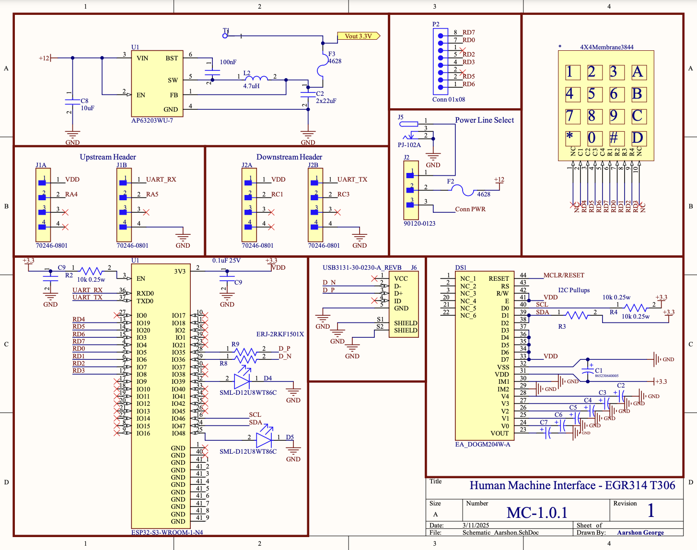

# Schematic

## Schematic Image
 

## 📁 Download the Schematic Diagram  
[Download Schematic Diagram PDF](./assets/documents/schematic-egr314-4.0.pdf)

## 📁 Download the Schematic Zip File  
[Download Schematic Zip File](./assets/zip-files/EGR314_Aarshon_IndividualSub-2.0.zip)

# Schematic Design Overview
The HMI interface is built around a PIC18F47Q10 microcontroller with an I²C LCD and a 4×4 matrix keypad, all powered from a 12 V supply stepped down to 3.3 V. The schematic below details all connections between components, including power routing and signal lines:

#### Power Input & Regulator:
A 12 V, 15 A wall adapter feeds the board through a DC jack (or terminal). This 12 V input is routed to a 3-pin jumper header (Molex 90120-0123) acting as a power source selector. The selector’s center pin goes to the AP63203WU-7 buck regulator’s VIN; one outer pin connects to the external 12 V jack and the other to the “upstream” 12 V line from the system bus. By placing a jumper, the regulator VIN can be fed from either the external adapter or an upstream supply (but never both). The AP63203WU-7 is a 3.3 V, 2 A synchronous buck converter that steps 12 V down to 3.3 V for all electronics. Its output (VOUT) is filtered with two 22 µF ceramics and a 0.1 µF capacitor to ensure stable DC output, and its input (VIN) is decoupled with a 10 µF bulk capacitor. The regulator’s feedback (FB) pin is tied directly to 3.3 V (fixed-output mode), and the EN pin is tied high (to VIN) for automatic startup.

#### Upstream/Downstream bus connectors:
Two 8-pin low-profile shrouded headers (Molex 70246-0801) carry power and signals to other modules. The 12 V bus from the power selector connects to pin 1 of both headers (and thus distributes 12 V to other boards). The regulated 3.3 V output is made available on pin 2 of the headers for powering downstream logic if needed. Pins 3–4 are tied to ground (providing at least two ground return paths for current). The remaining pins carry I²C and general-purpose signals (described below).

#### Keypad Interface:
The 4×4 matrix keypad connects to eight PIC GPIOs. Four row lines are driven as outputs, and four column lines are inputs with interrupt-on-change. The PIC18F47Q10’s PORTB is ideal since RB4–RB7 support “interrupt on change” (IOC) for keypress detection. In the schematic, RB0–RB3 are connected to Row1–Row4 of the keypad, and RB4–RB7 to Col1–Col4. Each row output goes through a 220 Ω resistor before the keypad connector – this small resistance protects the MCU pins in case multiple keys are pressed forming a short between a driven-high and driven-low row. 
When any key is pressed, it connects a row (which the firmware will drive low during scan) to a column, pulling that column input low and triggering an IOC interrupt. The MCU firmware will service this interrupt and then scan the rows one-by-one to identify the exact key. Each column input pin has a 0.1 µF capacitor to ground for debounce filtering (optional, can also be handled in software). The keypad’s 8-pin connector is wired straight to the PIC pins (with the series resistors on row lines as noted). Ground from the keypad’s common pin (if any shielding or reference) is tied to the board ground. The keypad connector and signals are placed away from the switching regulator on the PCB to avoid noise coupling into the high-impedance input lines. External ESD protection TVS diodes are added on the row/col lines at the connector to clamp any static discharges from user touch.