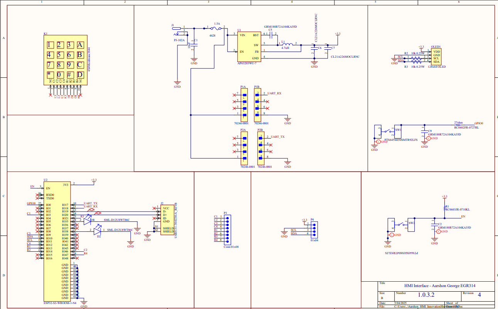
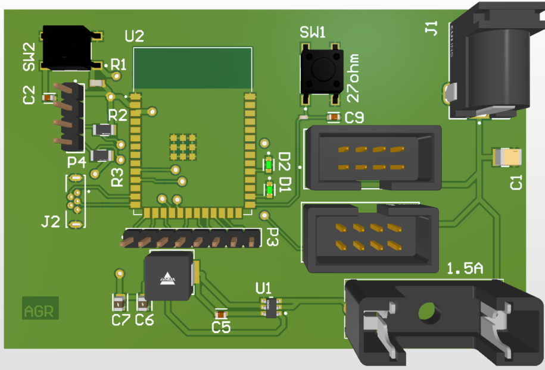
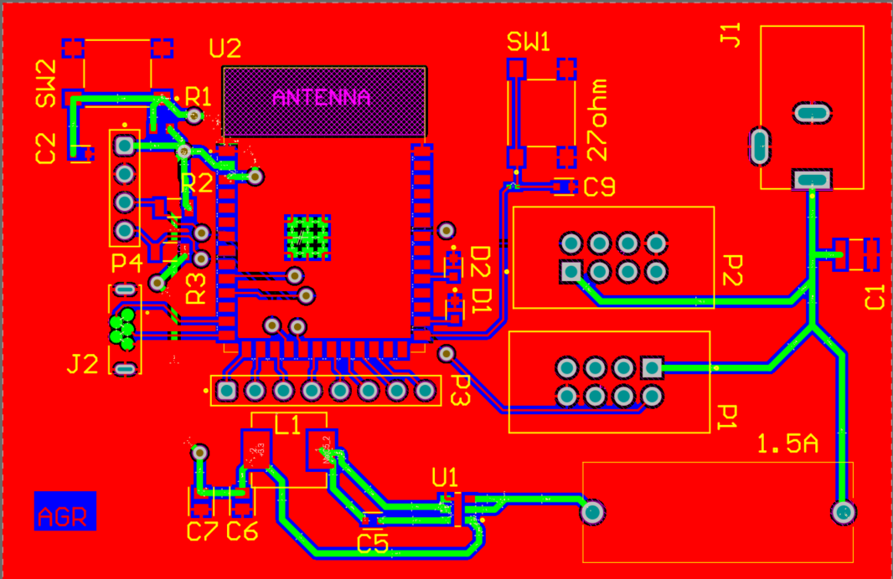
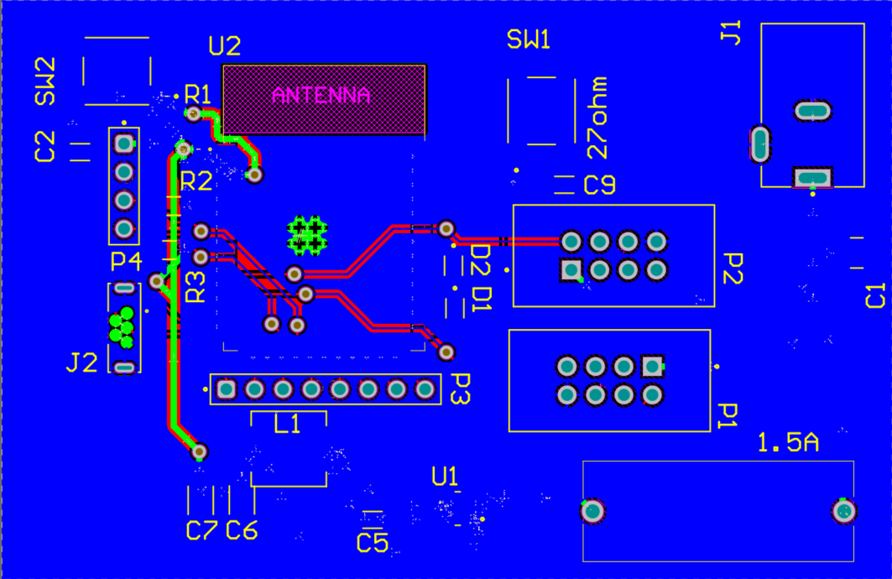

# Schematic & PCB Design

## Schematic Image
 

## PCB Image

## 📁 Download the Schematic Diagram  
[Download Schematic Diagram PDF](./assets/documents/schematic-egr314-5.0.pdf)

## 📁 Download the Project Zip File  
[Download Schematic Zip File](./assets/zip-files/EGR314_Aarshon_IndividualSub-3.0.zip)

# Schematic Design Overview
The HMI interface is built around a ESP32-S3-WROOM microcontroller with an I²C LCD and a 4×4 matrix keypad, all powered from a 12 V supply stepped down to 3.3 V. The schematic below details all connections between components, including power routing and signal lines:

#### Power Input & Regulator:
A 12 V, 15 A wall adapter feeds the board through a DC jack (or terminal). This 12 V input is routed to a 3-pin jumper header acting as a power source selector. The selector’s center pin goes to the AP63203WU-7 buck regulator’s VIN; one outer pin connects to the external 12 V jack and the other to the “upstream” 12 V line from the system bus. By placing a jumper, the regulator VIN can be fed from either the external adapter or an upstream supply (but never both). The AP63203WU-7 is a 3.3 V, 2 A synchronous buck converter that steps 12 V down to 3.3 V for all electronics. Its output (VOUT) is filtered with two 22 µF ceramics and a 0.1 µF capacitor to ensure stable DC output, and its input (VIN) is decoupled with a 10 µF bulk capacitor. The regulator’s feedback (FB) pin is tied directly to 3.3 V (fixed-output mode), and the EN pin is tied high (to VIN) for automatic startup.

#### Upstream/Downstream bus connectors:
Two 8-pin low-profile shrouded headers carry power and signals to other modules. The 12 V bus from the power selector connects to pin 1 of both headers (and thus distributes 12 V to other boards). The regulated 3.3 V output is made available on pin 2 of the headers for powering downstream logic if needed. Pins 3–4 are tied to ground (providing at least two ground return paths for current). The remaining pins carry I²C and general-purpose signals (described below).

#### Keypad Interface:
The 4×4 matrix keypad connects to eight GPIOs. Four row lines are driven as outputs, and four column lines are inputs with interrupt-on-change. The ESP32-S3-WROOM is ideal since RB4–RB7 support “interrupt on change” (IOC) for keypress detection. In the schematic, RB0–RB3 are connected to Row1–Row4 of the keypad, and RB4–RB7 to Col1–Col4. Each row output goes through a 220 Ω resistor before the keypad connector.

When any key is pressed, it connects a row (which the firmware will drive low during scan) to a column, pulling that column input low and triggering an IOC interrupt. The keypad’s 8-pin connector is wired straight to the ESP pins (with the series resistors on row lines as noted). Ground from the keypad’s common pin (if any shielding or reference) is tied to the board ground. The keypad connector and signals are placed away from the switching regulator on the PCB to avoid noise coupling into the high-impedance input lines.

## Design & Decision Making Process

At our very first white‑board session we wrote the K‑12 “day‑of‑expo” scenario in the middle and drew concentric rings of constraints around it: What must the student see? What must they press? How long may it stay unpowered? Only when every stakeholder need (student, teacher, grader, maintenance tech) had at least one measurable requirement did we let ourselves name silicon. This kept us from biasing the solution toward the parts already in our junk boxes.

#### Motor node (Alex).

Alex’s step‑per‑degree motor driver had to accept angle commands regardless of which upstream board sent them. Together we fixed on a single‑byte ± 255‑degree payload inside our “A Z … Y B” UART frame and pressure‑tested it with Alex’s firmware on the bench while I injected frames from both a logic‑generator and the ESP32 REPL. That exercise caught an endian mismatch early, so the motor now snaps exactly 5° whenever the keypad issues a * or #.

#### Sensor pod (Kushagra) and individual sensors (Ian).

Ian’s raw temperature, humidity, wind, and barometric sensors all speak I²C at 3 .3 V, but Kushagra’s aggregate board repackages them into the same UART frame structure the motor uses. This meant the HMI had only one parser to maintain. As a group we defined SUB_TEMP = 2, SUB_HUM = 3, and so on, then wrote a shared header file so C on the PIC and MicroPython on the ESP32 compile against the same constants. In joint testing we flooded the bus with out‑of‑order packets; the OLED still showed coherent readings because every packet has its sub‑ID stamped on byte 0.

#### MQTT bridge (me).

My ESP32 HMI had to forward valid sensor frames to KD's Wi‑Fi without breaking the real‑time motor link. To guarantee coexistence I ran the UART parser in an IRQ‑free tight loop, queued decoded readings, and let an asyncio task publish to MQTT in the background. This proved our bandwidth budgeting and ensured no component monopolised the ESP32.

#### Team glue.

Every Friday we swapped boards: Ian plugged his sensor PCB into Kushagra’s hub, which then talked to Alex’s motor driver on a separate power rail while my HMI listened and posted MQTT. The result is a set of subsystems that slot together seamlessly—the motor moves when data arrives, the HMI never displays stale numbers, and remote dashboards mirror exactly what the kids see in front of them—all because compatibility was baked into every sprint, not stapled on at the end. 